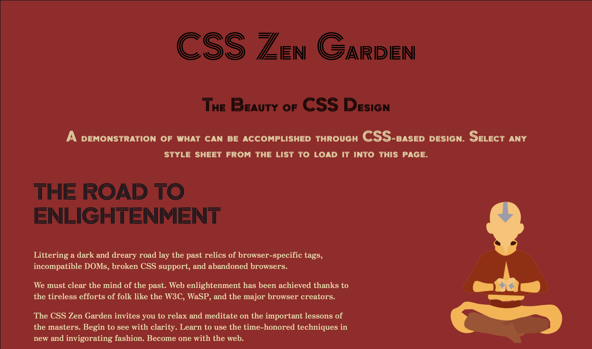

# CSS Zen Garden

## Finding My Zen

Although CSS was introduced just before Christmas in 1996, the adoption of the language didn't pick up rapidly. While
it's hard to think of the technology _not_ being used today, there existed a time when it wasn't so wide-spread.
To facilitate adoption, developer [Dave Shea](http://www.daveshea.com/) introduced the [CSS Zen Garden](http://www.csszengarden.com/), 
a site whose goal was to prove how powerful and useful the language could be. It posed a simple challenge: 
without touching the HTML of a provided page, how many different designs could one apply to the page
using _purely changes to the CSS_. (The rules also allowed for uploading custom images, but no changes to the `index.html`
file were allowed.)

The final answer? 218 (accepted designs), though the creator admits that there were thousands of submissions.

My goal for this project was to create my own aesthetic CSS Zen Garden entry with my newly found CSS skill.

In addition, my design:

* Passes W3C CSS validation
* Uses a color scheme which has enough contrast to be legible to all visitors

## Screenshots

## Lessons Learned

As this was my first project to complete using CSS, I had to put into practice what I learned in my Web Development class. Participating in the CSS Zen Garden design challenge was really fun, and I learned a lot about CSS layout, positioning, background images, pseudo-classes, and CSS units such as px, em, rem, vh, and vh, just to name a few. I believe in the idea that practice makes perfect and knowledge without real-life practicality is useless. Therefore, practicing CSS by completing this project helped me to really learn certain aspects of the language.
